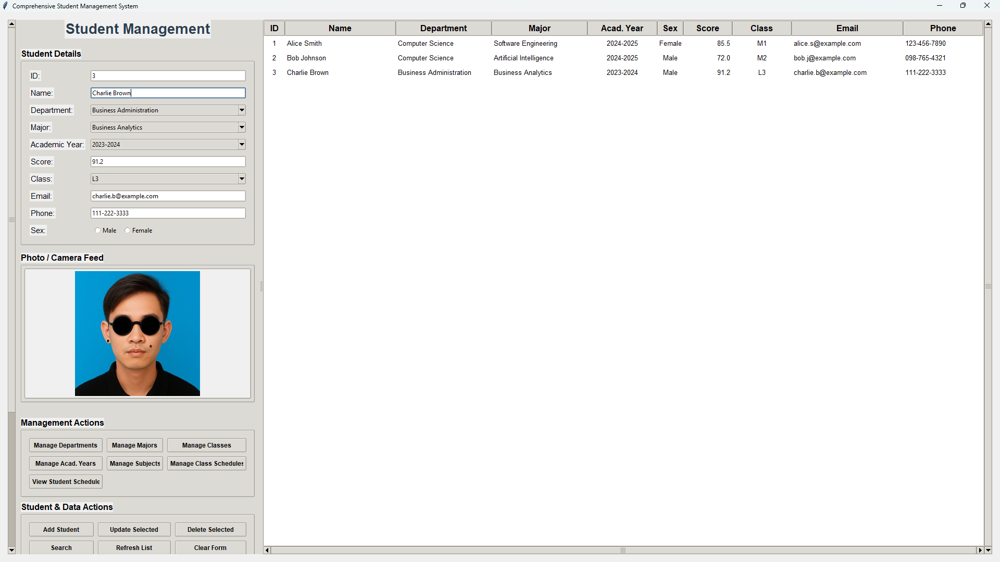
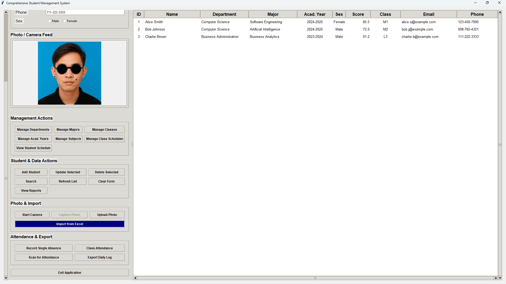

# Face_Recognition_School_Management
### ប្រព័ន្ធគ្រប់គ្រងសិស្ស ជាមួយនឹងការស្កេនមុខ (STUDENT MANAGEMENT SYSTEM WITH FACE RECOGNITION)




## ទិដ្ឋភាពទូទៅនៃគម្រោង (Project Overview)
នេះគឺជាប្រព័ន្ធគ្រប់គ្រងសិស្ស (SMS) ដ៏ទូលំទូលាយមួយ ដែលភ្ជាប់មកជាមួយនូវប្រព័ន្ធសម្គាល់មុខ (Face Recognition) សម្រាប់កត់ត្រាវត្ដមាន។ វាអនុញ្ញាតឱ្យអ្នកគ្រប់គ្រងសិស្ស, ដេប៉ាតឺម៉ង់, ជំនាញ, ថ្នាក់រៀន, ឆ្នាំសិក្សា, មុខវិជ្ជា, កាលវិភាគ និងកំណត់ត្រាវត្តមាន។ ប្រព័ន្ធនេះត្រូវបានបង្កើតឡើងដោយប្រើប្រាស់ GUI ទំនើបរបស់ **Tkinter**, ប្រព័ន្ធទិន្នន័យ **MySQL**, ការនាំចូល/នាំចេញឯកសារ **Excel**, និងការថតរូបភាពតាមរយៈ Webcam។

## លក្ខណៈពិសេសសំខាន់ៗ (Main Features)
- បន្ថែម, ធ្វើបច្ចុប្បន្នភាព, លុប, និងស្វែងរកទិន្នន័យសិស្ស
- គ្រប់គ្រងដេប៉ាតឺម៉ង់, ជំនាញ, ថ្នាក់រៀន, ឆ្នាំសិក្សា និងមុខវិជ្ជា
- កំណត់កាលវិភាគសិក្សា
- កត់ត្រាវត្តមាន (ដោយដៃ និងតាមរយៈការស្កេនមុខ)
- នាំចូល/នាំចេញទិន្នន័យដោយប្រើឯកសារ Excel
- មើល និងបង្កើតរបាយការណ៍វត្តមាន

## របៀបប្រើប្រាស់ (How to Use)

### 1. ដំឡើងកម្មវិធីដែលត្រូវការ (Install Requirements)
- **Python 3.8** ឡើងទៅ
- **MySQL Server** (កែប្រែព័ត៌មាននៅក្នុង `db_utils.py` ប្រសិនបើចាំបាច់)
- ដំឡើង Python packages ដូចខាងក្រោម៖
   ```bash
   pip install mysql-connector-python opencv-python pillow pandas numpy tkcalendar face_recognition

```

### 2. ការរៀបចំមូលដ្ឋានទិន្នន័យ (Database Setup)

* កម្មវិធីនឹងបង្កើត Database និង Tables ដោយស្វ័យប្រវត្តិនៅពេលដំណើរការលើកដំបូង។
* ជាជម្រើស អ្នកអាចដំណើរការកូដ SQL នៅក្នុង `MyDatabase.txt` ដោយប្រើកម្មវិធី MySQL client។

### 3. ដំណើរការកម្មវិធី (Run the Application)

* បើកកម្មវិធីដោយប្រើបញ្ជា៖
```bash
python main_app.py

```


* ផ្ទាំងបង្អួចដើមនឹងបើកឡើង។ ប្រើផ្នែកខាងឆ្វេងសម្រាប់ព័ត៌មានលម្អិតសិស្ស និងសកម្មភាពផ្សេងៗ ហើយផ្នែកខាងស្តាំសម្រាប់មើលបញ្ជីសិស្ស។

### 4. សកម្មភាពសំខាន់ៗ (Key Actions)

* ប្រើ **"Add Student"** ដើម្បីបង្កើតទិន្នន័យថ្មី។
* ប្រើ **"Manage Departments/Majors/Classes/Subjects"** ដើម្បីកែសម្រួលតារាងទិន្នន័យយោង។
* ប្រើ **"Import from Excel"** ដើម្បីបន្ថែមសិស្សជាច្រើនក្នុងពេលតែមួយ។
* ប្រើ **"Start Camera"** និង **"Capture Photo"** ដើម្បីថតរូបសិស្ស។
* ប្រើ **"Scan for Attendance"** ដើម្បីកត់វត្តមានតាមរយៈការស្កេនមុខ។
* ប្រើ **"Export Daily Log"** ដើម្បីនាំចេញទិន្នន័យវត្តមានទៅជាឯកសារ Excel។

## គោលបំណងនៃឯកសារកូដនីមួយៗ (Purpose of Each Code File)

* **`main_app.py`**: ជាចំណុចចាប់ផ្តើមនៃកម្មវិធី (Main entry point)។ វាបង្កើត GUI, ភ្ជាប់ម៉ូឌុលនានា និងគ្រប់គ្រងដំណើរការរបស់កម្មវិធី។
* **`ui_components.py`**: រាល់សមាសធាតុ Tkinter UI, ប្លង់ (Layouts), និងរចនាប័ទ្ម (Styles)។
* **`student_ops.py`**: ប្រតិបត្តិការ CRUD សម្រាប់សិស្ស, ការគ្រប់គ្រងទម្រង់ (Form), និងការគ្រប់គ្រង Treeview។
* **`db_utils.py`**: ការតភ្ជាប់ Database, ការបង្កើត Schema, ការប្រតិបត្តិ Query, និងការរក្សាទុកទិន្នន័យបណ្តោះអាសន្ន (Caching)។
* **`excel_utils.py`**: ការនាំចូល/នាំចេញ ទិន្នន័យសិស្ស និងវត្តមាន ពី/ទៅ ឯកសារ Excel។
* **`camera_utils.py`**: ការតភ្ជាប់ Webcam, ការថតរូប, ការ Upload រូបភាព និងការបង្ហាញរូបភាព។
* **`manager_dialogs.py`**: ផ្ទាំង Dialog សម្រាប់គ្រប់គ្រងដេប៉ាតឺម៉ង់, ជំនាញ, ថ្នាក់រៀន, មុខវិជ្ជា និងកាលវិភាគ។
* **`attendance_features.py`**: ការកត់ត្រាវត្តមាន (ដោយដៃ និងស្កេនមុខ), ការធ្វើរបាយការណ៍ និងការមើលកាលវិភាគ។
* **`test.py`**: ស្គ្រីបសម្រាប់សាកល្បងការវាយអក្សរខ្មែរនៅក្នុង Tkinter។
* **`MyDatabase.txt`**: ស្គ្រីប SQL ដើម្បីបង្កើតតារាងទាំងអស់ និងបញ្ចូលទិន្នន័យគំរូ។

## កំណត់សម្គាល់ (Notes)

* សូមកែប្រែព័ត៌មានសម្ងាត់ MySQL នៅក្នុង `db_utils.py` ប្រសិនបើការកំណត់របស់អ្នកខុសគ្នា។
* ការស្កេនមុខ (Face recognition) ទាមទាររូបថតសិស្សដែលមានគុណភាពច្បាស់ល្អ។
* សម្រាប់ការប្រើប្រាស់ភាសាខ្មែរ សូមប្រាកដថាអ្នកបានដំឡើងពុម្ពអក្សរខ្មែរ (Khmer fonts) នៅក្នុងកុំព្យូទ័ររបស់អ្នក។

## ទំនាក់ទំនង (Contact)

សម្រាប់សំណួរ ឬបញ្ហានានា សូមទាក់ទងអ្នកថែទាំគម្រោង (Project Maintainer)។

តើអ្នកត្រូវការជំនួយក្នុងការបង្កើតឯកសារដំឡើង (Setup Guide) បន្ថែមទៀតទេ?
